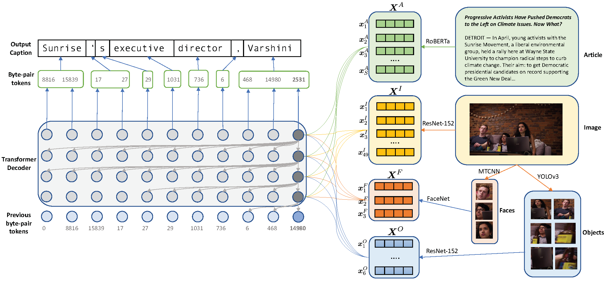

# Transform and Tell: Entity-Aware News Image Captioning



This repository contains the code to reproduce the results in our CVPR 2020
paper [Transform and Tell: Entity-Aware News Image
Captioning](https://arxiv.org/abs/2004.08070). We propose an end-to-end model
which generates captions for images embedded in news articles. News images
present two key challenges: they rely on real-world knowledge, especially about
named entities; and they typically have linguistically rich captions that
include uncommon words. We address the first challenge by associating words in
the caption with faces and objects in the image, via a multi-modal, multi-head
attention mechanism. We tackle the second challenge with a state-of-the-art
transformer language model that uses byte-pair-encoding to generate captions as
a sequence of word parts.

On the GoodNews dataset, our model outperforms the previous state of the art by
a factor of four in CIDEr score (13 to 54). This performance gain comes from a
unique combination of language models, word representation, image embeddings,
face embeddings, object embeddings, and improvements in neural network design.
We also introduce the NYTimes800k dataset which is 70% larger than GoodNews,
has higher article quality, and includes the locations of images within
articles as an additional contextual cue.

A live demo can be accessed [here](https://transform-and-tell.ml/).  In the
demo, you can provide the URL to a New York Times article. The server will then
scrape the web page, extract the article and image, and feed them into our
model to generate a caption.

Please cite with the following BibTeX:

```raw
@InProceedings{Tran2020Tell,
  author = {Tran, Alasdair and Mathews, Alexander and Xie, Lexing},
  title = {{Transform and Tell: Entity-Aware News Image Captioning}},
  booktitle = {The IEEE Conference on Computer Vision and Pattern Recognition (CVPR)},
  month = {June},
  year = {2020}
}
```

## Requirements

```sh
# Install Anaconda for Python and then create a dedicated environment.
# This will make it easier to reproduce our experimental numbers.
conda env create -f conda.yaml
conda activate tell

# This step is only needed if you want to use the Jupyter notebook
python -m ipykernel install --user --name tell --display-name "tell"

# We also pin the apex version, which is used for mixed precision training
cd libs/apex
git submodule init && git submodule update .
pip install -v --no-cache-dir --global-option="--pyprof" --global-option="--cpp_ext" --global-option="--cuda_ext" ./

# Install our package
cd ../.. && python setup.py develop

# Spacy is used to calcuate some of the evaluation metrics
spacy download en_core_web_lg
```

## Getting Data

You can either collect the NYTimes800k dataset from scratch yourself (it will
take a few days), or please send an email to `first.last@anu.edu.au` (where
`first` is `alasdair` and `last` is `tran`) to request the MongoDB dump that
contains the dataset.

```sh
# Start local MongoDB server on port 27017
mkdir data/mongodb
mongod --bind_ip_all --dbpath data/mongodb --wiredTigerCacheSizeGB 10

# Get article URLs from New York Times. Register for an API at
# https://developer.nytimes.com/apis
python scripts/get_urls.py API_KEY
# Construct the NYTimes800k dataset
python scripts/get_articles_nytimes.py
python scripts/process_images.py -i data/nytimes/images -o data/nytimes/images_processed # takes 6h
python scripts/annotate_nytimes.py
python scripts/detect_facenet_nytimes.py

# Object detection for goodnews (takes 19 hours)
CUDA_VISIBLE_DEVICES=0 python scripts/annotate_yolo3.py \
    --source data/goodnews/images \
    --output data/goodnews/objects \
    --dataset goodnews

# Object detection for nytimes (takes 19 hours)
CUDA_VISIBLE_DEVICES=0 python scripts/annotate_yolo3.py \
    --source data/nytimes/images \
    --output data/nytimes/objects \
    --dataset nytimes

# To reproduce the numbers in Good News, we need to have the same dataset as
# the original paper.
mkdir data/goodnews
wget 'https://drive.google.com/uc?export=download&id=1rl-3DgMRNV8g0AptwKRoYonNkYfT26sf' -O data/goodnews/img_splits.json
wget 'https://drive.google.com/uc?export=download&id=18078qCfdjOHuu75SjBLGNUSiIeq6zxJ-' -O data/goodnews/image_urls.json
URL="https://docs.google.com/uc?export=download&id=1rswGdNNfl4HoP9trslP0RUrcmSbg1_RD"
wget --load-cookies /tmp/cookies.txt "https://docs.google.com/uc?export=download&confirm=$(wget --quiet --save-cookies /tmp/cookies.txt --keep-session-cookies --no-check-certificate $URL -O- | sed -rn 's/.*confirm=([0-9A-Za-z_]+).*/\1\n/p')&id=1rswGdNNfl4HoP9trslP0RUrcmSbg1_RD" -O
data/goodnews/article_caption.json && rm -rf /tmp/cookies.txt
python scripts/get_articles_goodnews.py
python scripts/process_images.py -i data/goodnews/images -o data/goodnews/images_processed
python scripts/annotate_goodnews.py
python scripts/detect_facenet_goodnews.py
# To reproduce the original results, first request the output template captions
# from the authors and put the files in data/goodnews/original_results. Then
# run this command to generate the caption file in our format. In our recollected
# Good News dataset, we're missing 162 image-caption pairs in the test set.
python scripts/goodnews_insert.py --output ./data/goodnews/original_results/with\ article/vis_show_attend_tell_full_TBB.json
python scripts/goodnews_insert.py --output ./data/goodnews/original_results/with\ article/vis_show_attend_tell_full_avg.json
python scripts/goodnews_insert.py --output ./data/goodnews/original_results/with\ article/vis_show_attend_tell_full_wavg.json

# Compute basic statistics on the data
python scripts/compute_name_statistics.py
python scripts/compute_data_statistics.py
python scripts/get_unknown_caption_names.py
```

## Training and Evaluation

```sh
# Train the full model on NYTimes800k. This takes around 4 days on a Titan V GPU.
CUDA_VISIBLE_DEVICES=0 tell train expt/nytimes/9_transformer_objects/config.yaml -f

# Use the trained model to generate captions on the NYTimes800k test set
CUDA_VISIBLE_DEVICES=0 tell evaluate expt/nytimes/9_transformer_objects/config.yaml -m expt/nytimes/9_transformer_objects/serialization/best.th

# Compute the evaluation metrics on the test set
python scripts/compute_metrics.py -c data/nytimes/name_counters.pkl expt/nytimes/9_transformer_objects/serialization/generations.jsonl

# There are also other model variants which are ablation studies. Check
# our paper for more details.
```

## Acknowledgement

* The training and evaluation workflow is based on the
  [AllenNLP](https://github.com/allenai/allennlp) framework.

* The Dynamic Convolution architecture is built upon Facebook's
  [fairseq](https://github.com/pytorch/fairseq/blob/master/examples/pay_less_attention_paper/README.md)
  library.

* The ZeroMQ implementation of the demo backend server is based on
  [bert-as-service](https://github.com/hanxiao/bert-as-service).

* The front-end of the demo server is created with
  [create-react-app](https://github.com/facebook/create-react-app)

* ResNet code is adapted from the [Pytorch
  implementation](https://github.com/pytorch/vision/blob/master/torchvision/models/resnet.py).

* We use Ultralytics' [YOLOv3 implementation](https://github.com/ultralytics/yolov3).

* FaceNet and MTCNN implementations come from [here](https://github.com/timesler/facenet-pytorch).
